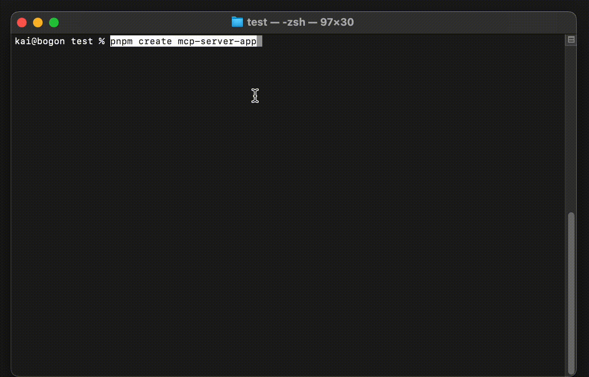
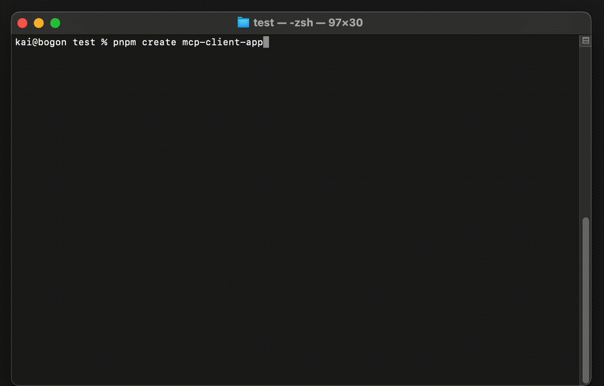

# create-mcp-app

A powerful scaffolding toolkit for creating Model Context Protocol (MCP) applications with modern development practices.

## Overview

create-mcp-app is a monorepo project that provides tools and templates for building MCP applications. It uses modern development practices and tools to ensure a smooth development experience. The project is designed to help developers quickly set up and start building MCP applications with best practices and modern tooling.

## Features

- 🚀 Instant project scaffolding for MCP applications
- 📦 First-class TypeScript support with strict type checking
- 🔧 Modern development toolchain with ESLint, Prettier, and Husky
- 🎯 Extensible and customizable templates for both server and client
- 🏗️ Monorepo architecture with Turborepo for efficient development
- 📝 Comprehensive documentation and examples
- 🔍 Built-in testing setup with Jest
- 🛠️ Development tools and utilities

## Project Structure

This project is organized as a monorepo using Turborepo, containing:

```
create-mcp-app/
├── apps/                          # Application packages
│   ├── create-mcp-server-app/     # Server application template
│   │   ├── src/                   # Source code
│   │   ├── boilerplate/          # Template files
│   │   ├── docs/                 # Documentation
│   │   └── dist/                 # Build output
│   │
│   └── create-mcp-client-app/    # Client application template
│       ├── src/                   # Source code
│       ├── boilerplate/          # Template files
│       ├── docs/                 # Documentation
│       └── dist/                 # Build output
│
├── packages/                      # Shared packages and configurations
├── .vscode/                      # VS Code configuration
└── package.json                  # Root package configuration
```

## Quick Start

To create a new MCP server application:

```bash
npx create-mcp-server-app@latest my-mcp-server
```



To create a new MCP client application:

```bash
npx create-mcp-client-app@latest my-mcp-client
```



## Development

### Prerequisites

- Node.js 16.x or later
- pnpm 7.x or later

### Package Management

This project uses pnpm for package management. To get started with development:

```bash
# Install dependencies
pnpm install

# Build all packages
pnpm build

# Run development environment
pnpm dev

# Run tests
pnpm test

# Lint code
pnpm lint
```

## Contributing

We welcome contributions! Here's how you can help:

1. Fork the repository
2. Create your feature branch (`git checkout -b feature/amazing-feature`)
3. Commit your changes (`git commit -m 'Add some amazing feature'`)
4. Push to the branch (`git push origin feature/amazing-feature`)
5. Open a Pull Request

Please make sure to:
- Follow the existing code style
- Add tests for new features
- Update documentation as needed
- Keep commits clean and well-described

## Issues and Bugs

If you find a bug or have a suggestion:

- [Open an issue](https://github.com/boguan/create-mcp-app/issues)
- [Submit a pull request](https://github.com/boguan/create-mcp-app/pulls)

## License

This project is licensed under the terms of the license included in the [LICENSE](./LICENSE) file.
