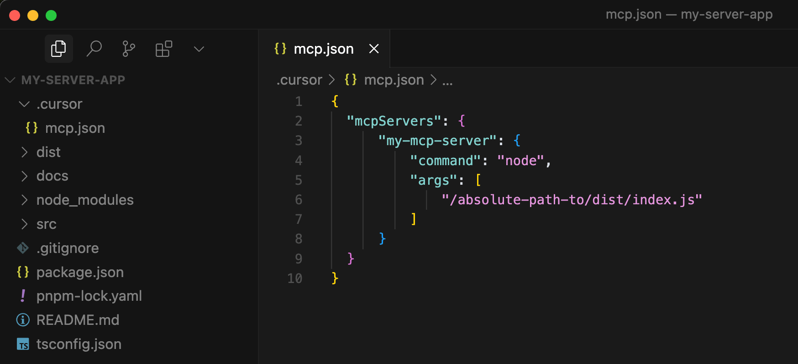
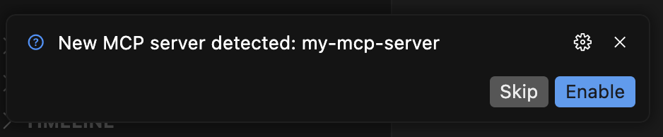
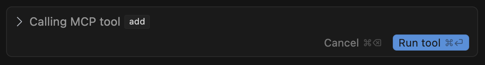
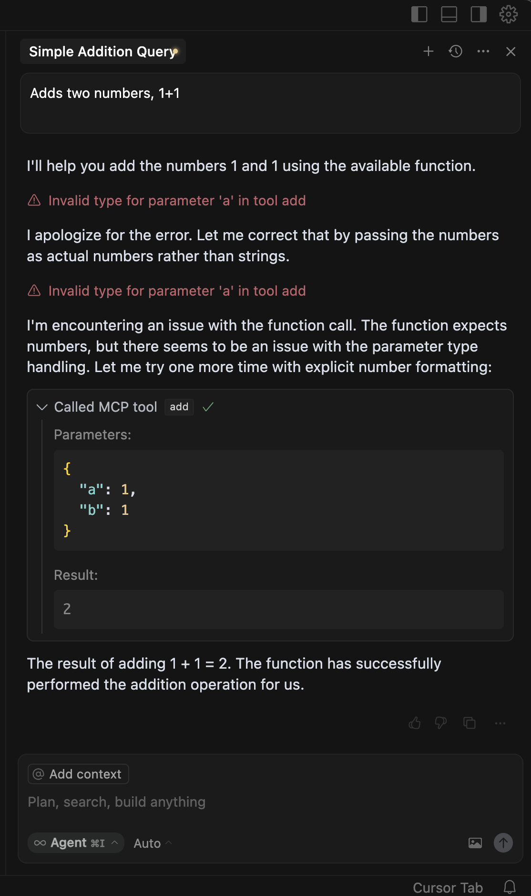
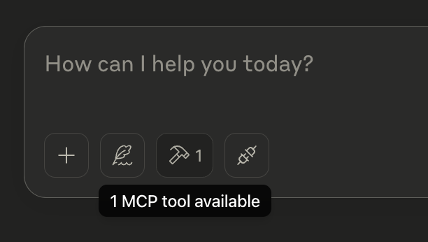
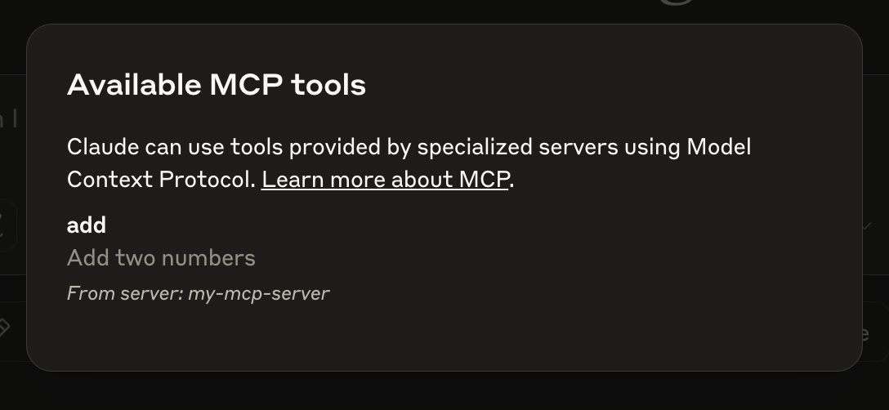
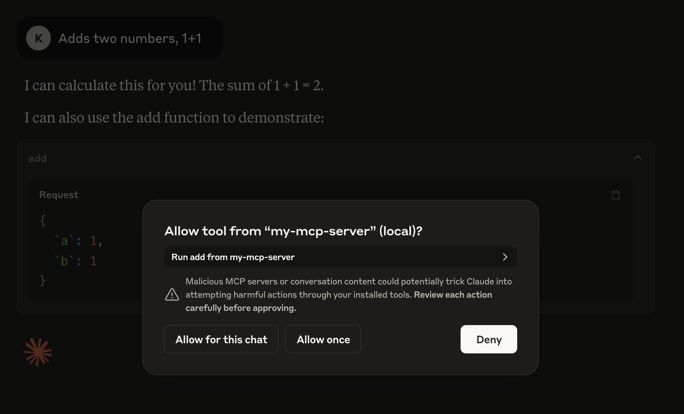

When development is completed, make sure to run `npm run build` to build your server! This is a very important step in getting your server to connect.

Let's now test your server from an existing MCP host, Cursor.

## Testing your server with Cursor

Cursor is a powerful IDE that supports MCP servers. Let's configure Cursor to use your MCP server.

First, make sure you have Cursor installed. [You can download the latest version here.](https://cursor.com)

We'll need to configure Cursor to use your MCP server. You can place this configuration in two locations, depending on your use case:

### Project Configuration
For tools specific to a project, create a `.cursor/mcp.json` file in your project directory. This allows you to define MCP servers that are only available within that specific project.



### Global Configuration
For tools that you want to use across all projects, create a `~/.cursor/mcp.json` file in your home directory. This makes MCP servers available in all your Cursor workspaces.

Create or edit the configuration file with the following content:

```json
{
    "mcpServers": {
        "my-mcp-server": {
            "command": "node",
            "args": [
                "/absolute-path-to/dist/index.js"
            ]
        }
    }
}
```

This configuration tells Cursor:
- There's an MCP server named "my-mcp-server" (keep this the same as the bin entry in package.json)
- It can be launched by running `node /absolute-path-to/dist/index.js`

After saving the configuration:
1. Cursor will automatically detect the new MCP server and show a prompt like "New MCP server detected: my-mcp-server"

2. Click "Enable" in the prompt to activate your server—no need to restart Cursor
3. You can then open the chat panel and verify the server is connected by checking the available tools

To test your server, you can ask Cursor to use your tool. For example:
```
Adds two numbers, 1+1
```

Cursor will:
1. Analyze your request
2. Identify the appropriate tool to use
3. Request your approval for tool usage, showing the tool name and arguments

4. Execute the tool through the MCP server
5. Display the results in the chat



*In the above image, you can see 'Invalid type for parameter 'a' in tool add', which is due to Cursor passing incorrect parameter types when calling the large language model. However, Cursor will correct the parameter types based on the error message returned and attempt to make the request again.*

The tool execution flow in Cursor follows the same pattern as described in the previous section:
1. Cursor creates an MCP Client that maintains a connection with your server
2. The AI analyzes available tools and decides which to use
3. The client executes the chosen tool through the server
4. Results are returned to the AI for processing
5. The final response is displayed in the chat

Now that we've tested the server with Cursor, for more details on how to set up MCP servers in Cursor, see [MCP docs for Cursor](https://docs.cursor.com/integrations/mcp). 

Let's try it with another MCP host - Claude for Desktop.

## Testing your server with Claude for Desktop

*Claude for Desktop is not yet available on Linux. Linux users can proceed to the [Building a client](https://modelcontextprotocol.io/quickstart/client) tutorial to build an MCP client that connects to the server we just built.*

First, make sure you have Claude for Desktop installed. [You can install the latest version here.](https://claude.ai/download) If you already have Claude for Desktop, **make sure it's updated to the latest version.**

We'll need to configure Claude for Desktop for whichever MCP servers you want to use.

Open the configuration file at `~/Library/Application Support/Claude/claude_desktop_config.json`. If this is your first time configuring it, the chances are the file does not exist yet. Simple create one with the same name.

Let's add the following to it.

```json Javascript
{
    "mcpServers": {
        "my-mcp-server": {
            "command": "node",
            "args": [
                "/absolute-path-to/dist/index.js"
            ]
        }
    }
}
```

This will tell Claude for Desktop that

There's an MCP server named "my-mcp-server". I will recommend keep this the same as the bin entry in package.json.
It can be launched by running node /absolute-path-to/build/index.js
Save it and restart Claude for Desktop.

To make sure that the configuration is indeed reflected and Claude for Desktop is picking up the tool we are exposing in our MCP Server, we can hover over the hammer icon and see that it is telling us 1 MCP tools available, assuming you don't have any other MCP servers added to the configuration file.



If we click on the hammer icon, we should see our tool listed like following.



If the hammer icon has shown up, you can now test your server by running the following command in Claude for Desktop:

`Adds two numbers, 1+1`

You should see it asking for the permission to use the tool. Claude will not do anything without our permission. We will have to explicitly agree.



If you click on the `Allow for this chat` or `Allow once` button, you should see the result of the tool execution.


For more details on how to set up MCP servers in Claude Desktop, see [MCP docs for Claude Desktop](https://modelcontextprotocol.io/quickstart/user).

That's it!

## Understanding the MCP Tool Execution Flow

If you are familiar with Foundation Models/LLM/Function calls, what happened right here might seem to be pretty straightforward, but let's be explicit because it is actually more than function calls!

First of all, when we add an MCP Server to `claude_desktop_config.json`

1. Claude for Desktop will create a new MCP Client that maintain a 1-to-1 connections with the server.
2. It then ask the client to list the tools exposed by the server. That's what we saw when we click on the hammer icon.

We then enter our prompt:

1. The host (Claude for Desktop in this case) sends our question to AI (Claude here).
2. AI analyzes the available tools and decides which one(s) to use with the arguments required by the tool.
3. The host determines which MCP Client is responsible for the MCP Server that exposes the tool
4. Executes the chosen tool(s) by having the client calling the the server and obtains a response(result)
5. Sends tool execution result back to AI for coordinating a final natural language response.
6. Displays the response

(Keep this flow some where in your mind because this is what we will be creating next! Our MCP Host with Clients!)

 Now that we have a solid foundation! To help you get started with building MCP clients quickly, we've created a convenient command-line tool [`create-mcp-client-app`](https://github.com/boguan/create-mcp-app/blob/main/apps/create-mcp-client-app/README.md).
