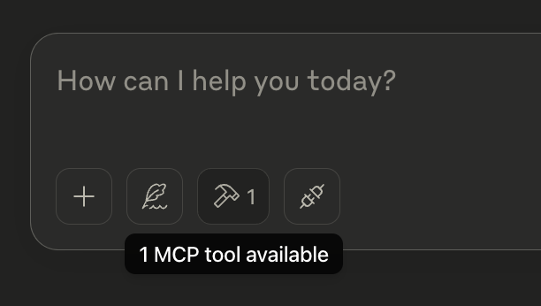
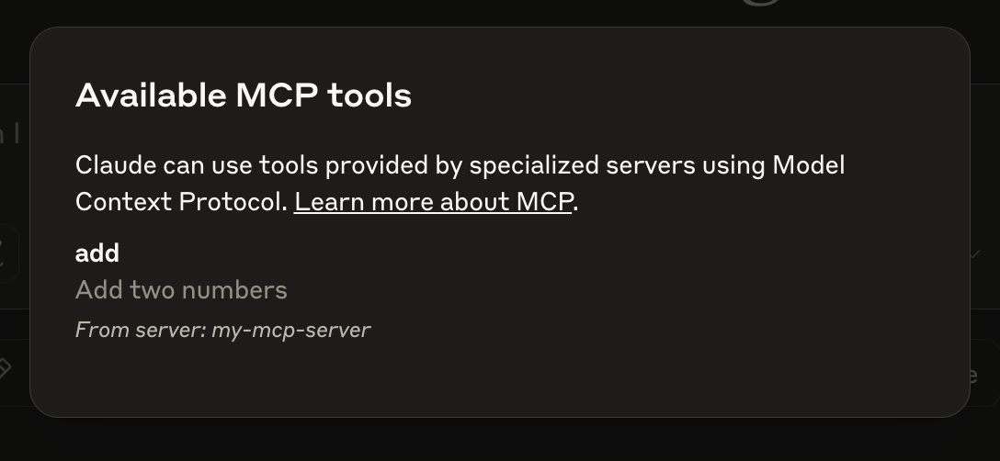
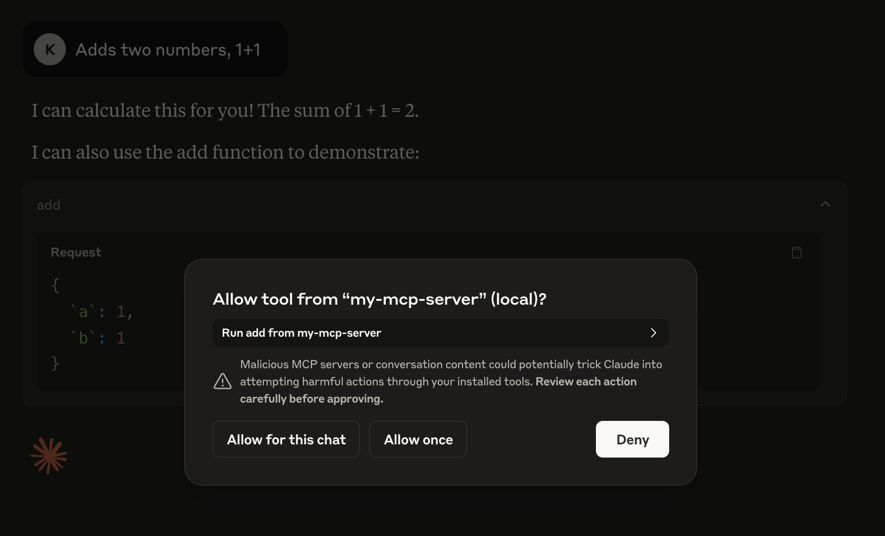
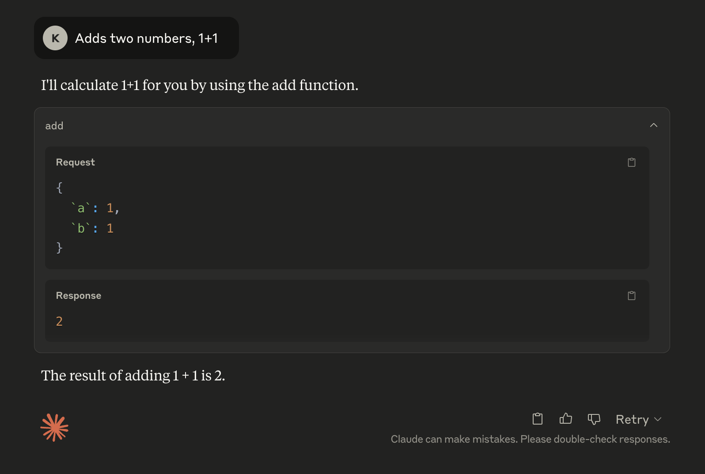

When development is completed, make sure to run `npm run build` to build your server! This is a very important step in getting your server to connect.

Let’s now test your server from an existing MCP host, Claude for Desktop.

## Testing your server with Claude for Desktop

*Claude for Desktop is not yet available on Linux. Linux users can proceed to the [Building a client](https://modelcontextprotocol.io/quickstart/client) tutorial to build an MCP client that connects to the server we just built.*

First, make sure you have Claude for Desktop installed. [You can install the latest version here.](https://claude.ai/download) If you already have Claude for Desktop, **make sure it's updated to the latest version.**

We'll need to configure Claude for Desktop for whichever MCP servers you want to use.

Open the configuration file at `~/Library/Application Support/Claude/claude_desktop_config.json`. If this is your first time configuring it, the chances are the file does not exist yet. Simple create one with the same name.

Let’s add the following to it.

```json Javascript
{
    "mcpServers": {
        "my-mcp-server": {
            "command": "node",
            "args": [
                "/absolute-path-to/dist/index.js"
            ]
        }
    }
}
```

This will tell Claude for Desktop that

There’s an MCP server named "my-mcp-server". I will recommend keep this the same as the bin entry in package.json.
It can be launched by running node /absolute-path-to/build/index.js
Save it and restart Claude for Desktop.

To make sure that the configuration is indeed reflected and Claude for Desktop is picking up the tool we are exposing in our MCP Server, we can hover over the hammer icon and see that it is telling us 1 MCP tools available, assuming you don’t have any other MCP servers added to the configuration file.



If we click on the hammer icon, we should see our tool listed like following.



If the hammer icon has shown up, you can now test your server by running the following command in Claude for Desktop:

`Adds two numbers, 1+1`

You should see it asking for the permission to use the tool. Claude will not do anything without our permission. We will have to explicitly agree.



If you click on the `Allow for this chat` or `Allow once` button, you should see the result of the tool execution.



That's it!

## Understanding the MCP Tool Execution Flow

If you are familiar with Foundation Models/LLM/Function calls, what happened right here might seem to be pretty straightforward, but let’s be explicit because it is actually more than function calls!

First of all, when we add an MCP Server to `claude_desktop_config.json`

1. Claude for Desktop will create a new MCP Client that maintain a 1-to-1 connections with the server.
2. It then ask the client to list the tools exposed by the server. That’s what we saw when we click on the hammer icon.

We then enter our prompt:

1. The host (Claude for Desktop in this case) sends our question to AI (Claude here).
2. AI analyzes the available tools and decides which one(s) to use with the arguments required by the tool.
3. The host determines which MCP Client is responsible for the MCP Server that exposes the tool
4. Executes the chosen tool(s) by having the client calling the the server and obtains a response(result)
5. Sends tool execution result back to AI for coordinating a final natural language response.
6. Displays the response

(Keep this flow some where in your mind because this is what we will be creating next! Our MCP Host with Clients!)